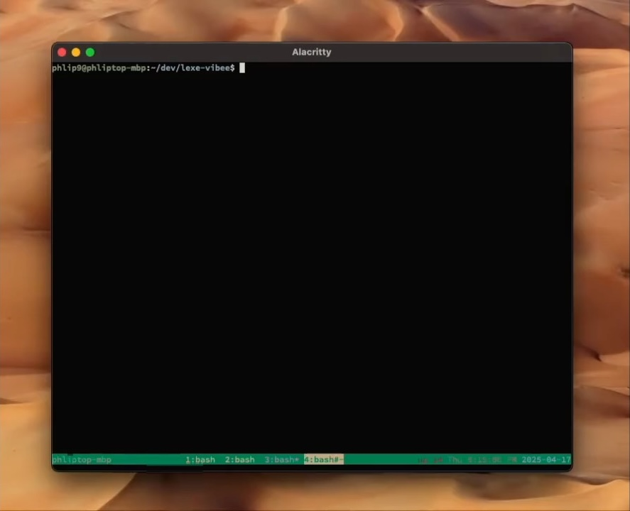

# Lexe Sidecar SDK

## Overview

The Lexe Sidecar SDK presents a simple JSON API for developers to control their
self-custodial, always-online [Lexe](https://lexe.app) node which can send and receive
payments over the Lightning Network. Running the `lexe-sidecar` binary spins up
a local webserver (the "sidecar") at `http://localhost:5393` which accepts REST
requests and proxies them to your Lexe node. By making simple HTTP requests like

```
POST http://localhost:5393/v1/node/create_invoice
POST http://localhost:5393/v1/node/pay_invoice
GET http://localhost:5393/v1/node/payment
```

you can programmatically control your Lexe node. Your app can be written in any
language, and is portable to any environment where the `lexe-sidecar` can run.

This repo contains public-facing docs for the Lexe Sidecar SDK.
The `lexe-sidecar` source code can be found in the Lexe monorepo at:
<https://github.com/lexe-app/lexe-public/tree/master/sdk-sidecar>

## Quickstart

### Download the Lexe Wallet app

To get started, you'll need a Lexe wallet. Download the mobile app for:

* iOS (Testflight): <https://lexe.app/beta-ios>
* Android (Play Store): <https://lexe.app/beta-android>

_iOS users_: Testflight sometimes asks for an "access code", which is different
from our signup code; you may need to reinstall the Testflight app to get past
this.

Next, create a new wallet, enter the signup code sent to your email, connect
your Google Drive (for backups), and set a backup password. This will create a
new self-custody Bitcoin+Lightning wallet that runs in a secure enclave in the
cloud; you can now send and receive Lightning payments 24/7!

### Export client credentials for the SDK

To control your wallet using the Lexe Sidecar SDK, you'll first need to export
client credentials from the app:

1. Open the Lexe app > Menu sidebar > "SDK clients" > "Create new client"
2. Copy the client credentials string

Go to your project directory and create your local `.env` from Lexe's example:

```bash
$ git clone https://github.com/lexe-app/lexe-sidecar-sdk.git
$ cd myproject
$ cp ../lexe-sidecar-sdk/.env.example ./.env
$ chmod 600 .env
```

Set `LEXE_CLIENT_CREDENTIALS` in `.env` to the client credentials string from
your Lexe app.

```bash
LEXE_CLIENT_CREDENTIALS="eyJsZXhlX2F1dGhfdG9rZ...TA0In0="
```

### Get the `lexe-sidecar` binary

The Lexe Sidecar SDK is distributed as a single self-contained binary called
`lexe-sidecar`. It runs a local stateless webserver that accepts HTTP requests
and manages the connection to your Lexe node.

There are two main ways to get the `lexe-sidecar` binary:

1) (Easy) Download a precompiled binary from the [Releases](https://github.com/lexe-app/lexe-sidecar-sdk/releases) page
2) Build the binary from Rust source: see [BUILD.md](BUILD.md) for instructions.

#### Using the `lexe-sidecar` as a Rust library

If you're working in Rust, you may also use the `lexe-sidecar` as a Rust
library, which provides:

- A `Sidecar` webserver which can be `.run()` within your async Rust app.
- A `SidecarClient` which fully implements the sidecar API.

See [example-rust](example-rust) for an example which implements both a sidecar
client and server.

Download the `lexe-sidecar` binary to your machine and run it from your project
directory which contains the `.env` file:

```bash
# Assumes the binary was downloaded to ./bin/lexe-sidecar
$ ./bin/lexe-sidecar
```

Make your first request to the sidecar:

```bash
$ curl http://localhost:5393/v1/node/node_info | jq .
{
  "version": "0.7.9",
  "measurement": "6d6ae19f2a82167abecd7bbe834e417a1b3c9c8971d08bd05b24533de21bf3f1",
  "user_pk": "63ad1661bfc23ad25f5bcc6f610f8fd70d7426de51be74766c24e47f4b4fcfca",
  "node_pk": "02e4d8f86591eb2ce59a787e2a5abb83278c86198ac22854e9e3cf365cf8d9730f",
  "balance": "95507",
  "lightning_balance": "40000",
  "usable_lightning_balance": "40000",
  "max_sendable_lightning_balance": "39824.777",
  "onchain_balance": "55507",
  "trusted_onchain_balance": "55507",
  "num_channels": 1,
  "num_usable_channels": 1
}
```

You're all set  - it's time to build your Lightning app! Here's a prompt which
allowed us to "vibe code" a fully functional Lightning tip page in less than 4
minutes with Claude Sonnet 3.7 and [`goose`](https://block.github.io/goose/) -
Cursor, Windsurf, etc work well too. Since this prompt tells the AI to run the
sidecar as a subprocess of your app, you should stop the running sidecar first.
Also be sure to change the project names and paths to match your own machine.

```
Build a tip page powered by the Lexe API. This will be a python web service that
renders a simple tip page for visitors to our site. When a visitor taps the tip
button, the backend will query the Lexe API for a new Lightning invoice and
render it as a QR code on the frontend. The frontend will repeatedly poll the
backend for the invoice status until it's paid. Once the invoice is paid,
it will go the success page and show a confetti animation.

The backend should spawn the Lexe sidecar as a subprocess. The sidecar will
expose the Lexe API at `http://localhost:5393`. You can find the sidecar binary
at </Users/satoshi/.local/bin/lexe-sidecar>. You can find the Lexe API docs
at: </Users/satoshi/dev/lexe-sidecar-sdk/README.md>. Make sure you read this
first so you understand how all the pieces fit together.

We're running on macOS and already have python 3.12 installed. You're already
in the project directory </Users/satoshi/dev/myproject>. Try to use the python
standard library as much as possible. Create a new python virtual environment to
keep all the dependencies isolated. The frontend can be a simple HTML page
rendered by the backend with some basic JS+CSS for polling and rendering the QR
code. Serve the backend on port 8080.

Don't ask for permission, just start coding.
```

## Demo

Watch us vibe code a fully functional Lightning tip page using the above
prompt in less than 3 minutes:

[Watch video](https://youtu.be/svGZW7IrK9M)

[](https://youtu.be/svGZW7IrK9M)

<!-- TODO(max): This should work too, but video is uploading rn -->
<!-- [](https://www.youtube.com/watch?v=svGZW7IrK9M) -->

## REST API Reference

The Lexe SDK sidecar exposes the following REST API endpoints:

```
GET /v1/health
GET /v1/node/node_info
POST /v1/node/create_invoice
POST /v1/node/pay_invoice
GET /v1/node/payment
```

### Conventions

Payments are uniquely identified by their `index` value string. Fetch the status
of a payment using the `GET /v1/node/payment?index=<index>` endpoint.

`amount` values are fixed-precision decimal values denominated in satoshis
(1 BTC = 100,000,000 satoshis) and serialized as strings. The representation
supports up-to millisatoshi precision (1 satoshi = 1,000 millisatoshis).

All timestamps indicate the number of milliseconds since the UNIX epoch.

Prefer longer request timeouts (e.g. 15 seconds) since your node may need time
to startup and sync if it hasn't received any requests in a while.

### `GET /v1/health`

Get the health status of the Lexe SDK sidecar. Returns HTTP 200 once the sidecar
is running and ready to accept requests.

**Examples:**

```bash
$ curl http://localhost:5393/v1/health
{ "status": "ok" }
```

### `GET /v1/node/node_info`

Fetch information about the node and wallet balance.

**Request:**

Empty.

**Response:**

- `version`: The node's current semver version, e.g. `0.6.9`.
- `measurement`: The hex-encoded SGX 'measurement' of the current node. The measurement is the hash of the enclave binary.
- `user_pk`: The hex-encoded ed25519 user public key used to identify a Lexe user. The user keypair is derived from the root seed.
- `node_pk`: The hex-encoded secp256k1 Lightning node public key; the `node_id`.

- `balance`: The sum of our `lightning_balance` and our `onchain_balance`, in sats.

- `lightning_balance`: Total Lightning balance in sats, summed over all of our channels.
- `lightning_sendable_balance`: An estimated upper bound, in sats, on how much
  of our Lightning balance we can send to most recipients on the Lightning
  Network, accounting for Lightning limits such as our channel reserve, pending
  HTLCs, fees, etc. You should usually be able to spend this amount.
- `lightning_max_sendable_balance`: A hard upper bound on how much of our
  Lightning balance can be spent right now, in sats. This is always >=
  `lightning_sendable_balance`. Generally it is only possible to spend exactly
  this amount if the recipient is a Lexe user.

- `onchain_balance`: Total on-chain balance in sats, including unconfirmed funds.
- `onchain_trusted_balance`: Trusted on-chain balance in sats, including only confirmed funds and unconfirmed outputs originating from our own wallet.

- `num_channels`: The total number of Lightning channels.
- `num_usable_channels`: The number of channels which are currently usable, i.e. `channel_ready` messages have been exchanged and the channel peer is online. Is always less than or equal to `num_channels`.

**Examples:**

```bash
$ curl http://localhost:5393/v1/node/node_info | jq .
{
  "version": "0.7.10",
  "measurement": "f7415694ca3262f8b479d915a1799f896902a8697c469f69d9a86eb8c9f1089f",
  "user_pk": "b484a4890b47358ee68684bcd502d2eefa1bc66cc0f8ac2e5f06384676be74eb",
  "node_pk": "0203e73be064cc91d5e3c96d8e2f2f124f3196e07e9916b51307b6ff5419b59f6e",
  "balance": "134736",
  "lightning_balance": "75282",
  "lightning_sendable_balance": "57505.107",
  "lightning_max_sendable_balance": "57203.107",
  "onchain_balance": "59454",
  "onchain_trusted_balance": "59454",
  "num_channels": 5,
  "num_usable_channels": 5
}
```

### `POST /v1/node/create_invoice`

Create a new BOLT11 Lightning invoice to receive Bitcoin over the Lightning
network.

**Request:**

The request body should be a JSON object with the following fields:

* `expiration_secs: Int`: The number of seconds until the invoice expires.
* `amount: String` (optional): The amount to request in satoshis, as a string.
  If not specified, the payer will decide the amount.
* `description: String` (optional): The payment description that will be
  presented to the payer.

**Response:**

The response includes the encoded `invoice` string, which should be presented to
the payer to complete the payment.

The `index` is a unique identifier for the invoice, which can be used to track
the payment status via `GET /v1/node/payment`.

- `index`: Identifier for this inbound invoice payment.
- `invoice`: The string-encoded BOLT 11 invoice.
- `description`: The description encoded in the invoice, if one was provided.
- `amount`: The amount encoded in the invoice, if there was one. Returning `null` means we created an amountless invoice.
- `created_at`: The invoice creation time, in milliseconds since the UNIX epoch.
- `expires_at`: The invoice expiration time, in milliseconds since the UNIX epoch.
- `payment_hash`: The hex-encoded payment hash of the invoice.
- `payment_secret`: The payment secret of the invoice.

**Examples:**

```bash
$ curl -X POST http://localhost:5393/v1/node/create_invoice \
    --header "content-type: application/json" \
    --data '{ "expiration_secs": 3600 }' \
    | jq .
{
  "index": "0000001744926519917-ln_9be5e4e3a0356cc4a7a1dce5a4af39e2896b7eb7b007ec6ca8c2f8434f21a63a",
  "invoice": "lnbc1p5qzaehdqqpp5n0j7fcaqx4kvffapmnj6fteeu2ykkl4hkqr7cm9gctuyxnep5caqcqpcsp5slzxgxrsu3jq8xq7rp2gx3ge0thlt3446jpp8kqs87pve60679ls9qyysgqxqrrssnp4q0vzagw8x7r9eyalw35t0u6syql8rtqf9tejep0z6xrwkqrua5advrzjqv22wafr68wtchd4vzq7mj7zf2uzpv67xsaxcemfzak7wp7p0r29wzmk4uqqj5sqqyqqqqqqqqqqhwqqfq89vuhjlg2tt56sv9pdt8t5cvdgfaaf6nxqtt0av74ragpql7l2d42euknlw06fcgp8xhe93xe7c802z3hrnysfsjgavmwfts7zdvj2cqka3672",
  "description": null,
  "amount": null,
  "created_at": 1744926519000,
  "expires_at": 1744930119000,
  "payment_hash": "9be5e4e3a0356cc4a7a1dce5a4af39e2896b7eb7b007ec6ca8c2f8434f21a63a",
  "payment_secret": "87c4641870e46403981e18548345197aeff5c6b5d48213d8103f82cce9faf17f"
}

$ curl -X POST http://localhost:5393/v1/node/create_invoice \
    --header "content-type: application/json" \
    --data '{ "expiration_secs": 3600, "amount": "1000", "description": "Lunch" }' \
    | jq .
{
  "index": "0000001744926580307-ln_12c8ec9465cff06b756b9f20dbdfd9d4b03b3c153bd39a5401c61a0241bd1e96",
  "invoice": "lnbc10u1p5qzam5dqgf36kucmgpp5ztywe9r9elcxkattnusdhh7e6jcrk0q480fe54qpccdqysdar6tqcqpcsp5f3nvkgufsxxnsfa4wnyzgjk3sjpxcwsp8zw4ck0mstcyrgpyu8ls9qyysgqxqrrssnp4q0vzagw8x7r9eyalw35t0u6syql8rtqf9tejep0z6xrwkqrua5advrzjqv22wafr68wtchd4vzq7mj7zf2uzpv67xsaxcemfzak7wp7p0r29wzmk4uqqj5sqqyqqqqqqqqqqhwqqfqdtsc32py445jyfcdwcnf25kwwh0ezvw0890xlpfjxtm4a9pcuyjpvd54alrze0tzxzl4cgm82q3deh7w66zsukuccrgzq59vpp28lvgp4jesmt",
  "description": "Lunch",
  "amount": "1000",
  "created_at": 1744926580000,
  "expires_at": 1744930180000,
  "payment_hash": "12c8ec9465cff06b756b9f20dbdfd9d4b03b3c153bd39a5401c61a0241bd1e96",
  "payment_secret": "4c66cb2389818d3827b574c8244ad184826c3a01389d5c59fb82f041a024e1ff"
}
```

### `POST /v1/node/pay_invoice`

Pay a BOLT11 Lightning invoice.

**Request:**

The request body should be a JSON object with the following fields:

* `invoice: String`: The encoded invoice string to pay.
* `fallback_amount: String` (optional): For invoices without an amount specified, you must specify a fallback amount to pay.
* `note: String` (optional): A personal note to attach to the payment. The receiver will not see this note.

**Response:**

The response includes the `index` of the payment, which can be used to track the
payment status via `GET /v1/node/payment`.

- `index`: Identifier for this outbound invoice payment.
- `created_at`: When we tried to pay this invoice, in milliseconds since the UNIX epoch.

**Examples:**

```bash
$ curl -X POST http://localhost:5393/v1/node/pay_invoice \
    --header "content-type: application/json" \
    --data '{ "invoice": "lnbc100n1p5qz7z2dq58skjqnr90pjjq4r9wd6qpp5u8uw073l8dp7ked0ujyhegwxx6yxx6aq5ganqyt3pepnk5dm87dqcqpcsp5nrs44f3upgxysnylrrpyrxs96mgazjjstuykyew74zv0najzkdeq9qyysgqxqyz5vqnp4q0w73a6xytxxrhuuvqnqjckemyhv6avveuftl64zzm5878vq3zr4jrzjqv22wafr68wtchd4vzq7mj7zf2uzpv67xsaxcemfzak7wp7p0r29wz5ecsqq2pgqqcqqqqqqqqqqhwqqfqrpeeq5xdys8vcfcark45w992h6j5nhajc62wet0q25ggxjwhtcfn8c3qx30fqzq8mqxfdtks57zw25zp0z2kl9yrfwkkthxclawxpfcqtdcpfu" }' \
    | jq .
{
  "index": "0000001744926842458-ln_e1f8e7fa3f3b43eb65afe4897ca1c63688636ba0a23b3011710e433b51bb3f9a",
  "created_at": 1744926842458
}
```

### `GET /v1/node/payment`

Use this endpoint to query the status of a payment or invoice. Payments will transition
through the following `status` states: `"pending" -> "completed"` or `"pending" -> "failed"`.
Once a payment is finalized (either completed or failed), you do not need to query
the payment any more.

**Request:**

The request should include the `index` of the payment query as a query string
parameter.

**Response:**

Payment details are nested within a returned `payment` field.

- `index`: Identifier for this payment.
- `kind`: The payment type: ["onchain", "invoice", "offer", "spontaneous"].
- `direction`: The payment direction: ["inbound", "outbound"].
- `txid`: (Onchain payments only) The txid of the on-chain payment.
- `replacement`: (Onchain payments only) The hex-encoded txid of the transaction that spent the outputs spent by this on-chain payment, if one exists.
- `status`: The status of this payment: ["pending", "completed", "failed"].
- `status_msg`: The payment status as a human-readable message. These strings are customized per payment type, e.g. "invoice generated", "timed out".
- `finalized_at`: If this payment is finalized, meaning it is "completed" or "failed", this is the time it was finalized, in milliseconds since the UNIX epoch.

**Examples:**

```bash
$ curl 'http://localhost:5393/v1/node/payment?index=0000001744926519917-ln_9be5e4e3a0356cc4a7a1dce5a4af39e2896b7eb7b007ec6ca8c2f8434f21a63a' \ 
     | jq .
{
  "payment": {
    "index": "0000001744926519917-ln_9be5e4e3a0356cc4a7a1dce5a4af39e2896b7eb7b007ec6ca8c2f8434f21a63a",
    "kind": "invoice",
    "direction": "inbound",
    "txid": null,
    "replacement": null,
    "amount": null,
    "fees": "0",
    "status": "pending",
    "status_msg": "invoice generated",
    "note": null
  }
}

$ curl 'http://localhost:5393/v1/node/payment?index=0000001744926842458-ln_e1f8e7fa3f3b43eb65afe4897ca1c63688636ba0a23b3011710e433b51bb3f9a' \
    | jq .
{
  "payment": {
    "index": "0000001744926842458-ln_e1f8e7fa3f3b43eb65afe4897ca1c63688636ba0a23b3011710e433b51bb3f9a",
    "kind": "invoice",
    "direction": "outbound",
    "txid": null,
    "replacement": null,
    "amount": "10",
    "fees": "0.03",
    "status": "completed",
    "status_msg": "completed",
    "note": "My personal note",
    "finalized_at": 1744926857989
  }
}
```
